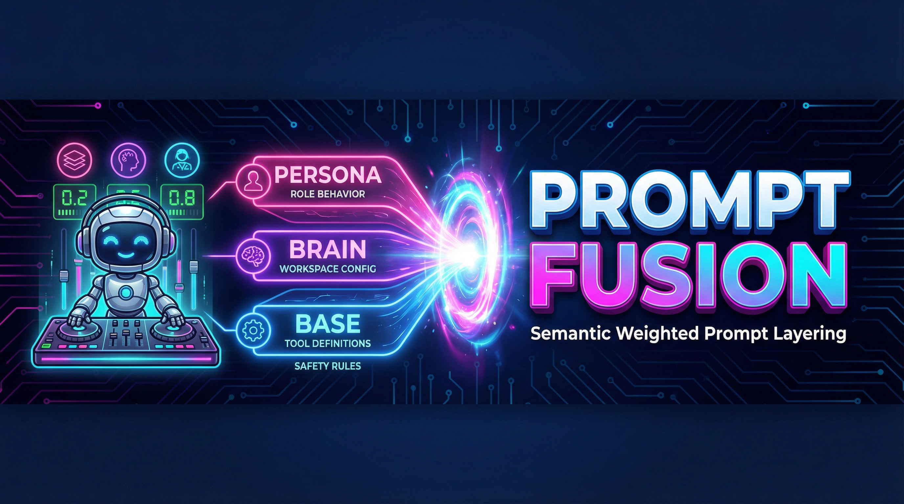

<div align="center">

</div>

# 🎯 Prompt Fusion

**Semantic Weighted Prompt Layering for AI Agents**

A sophisticated system for composing multi-layer prompts with intelligent priority management. Designed for AI agents that need to balance foundational rules, workspace configurations, and dynamic role-based behavior.

[](https://promptsfusion.com)
[](./LICENSE)
[]()
[]()

---

## 🙏 About

### The Author

**Ahmad Othman Ammar Adi** (Othman Adi)

Full Stack Developer, AI Agents Orchestrator, and passionate educator from Hama, Syria — now based in Berlin, Germany.

- 🎓 **Education**: Completed apprenticeship in Computer Science
- 👨‍🏫 **Teaching**: 8,000+ documented teaching lectures since 2020
- 📚 **Formats**: Workshops (days to weeks), intensive courses (2-6 months), and long-term programs including multi-year weekend coding classes for kids
- 💼 **Current Role**: AI Agents Orchestrator at migRaven

### The Project

This project emerged from practical challenges in building production AI agents that need to:
- Balance multiple instruction sources
- Adapt to different user roles
- Maintain safety while being flexible
- Work across different LLM providers

**Connect:**
- 🎯 Project Website: [promptsfusion.com](https://promptsfusion.com)
- 🌐 Personal Website: [othmanadi.com](https://othmanadi.com)
- 💼 LinkedIn: [codingwithadi](https://linkedin.com/in/codingwithadi)
- 🐙 GitHub: [OthmanAdi](https://github.com/OthmanAdi)

---

## 🌟 What is Prompt Fusion?

Prompt Fusion is a **three-layer prompt management system** that intelligently combines:

1. **Base Layer** - Tool definitions, safety rules, foundational constraints
2. **Brain Layer** - Workspace configuration, project context, user preferences
3. **Persona Layer** - Role-specific behavior, dynamic overlays

The innovation: **Semantic weighting** that translates numerical weights (0.0-1.0) into priority labels LLMs actually understand.

### The Problem It Solves

When building AI agents, you often need to combine:
- **Static base instructions** (what tools are available, safety rules)
- **Dynamic workspace config** (project context, user preferences)
- **Role-based overlays** (analyst vs. researcher vs. developer behavior)

Traditional approaches:
- ❌ Simple concatenation → No clear priorities
- ❌ Numerical weights → LLMs ignore subtle differences
- ❌ Hardcoded prompts → Can't adapt to roles/contexts

Prompt Fusion:
- ✅ **Semantic priorities** → "CRITICAL PRIORITY" vs "MODERATE GUIDANCE"
- ✅ **Automatic conflict resolution** → Explicit priority ordering
- ✅ **Dynamic composition** → Runtime role switching
- ✅ **Framework agnostic** → Works with any LLM framework

---

## 🚀 Quick Start

### Installation

```bash
# Clone the repository
git clone https://github.com/OthmanAdi/promptfusion.git
cd promptfusion

# Install (if publishing as package)
npm install prompt-fusion
```

### Basic Usage

```javascript
import PromptFusionEngine from './core/promptFusionEngine.js';

const engine = new PromptFusionEngine();

// Define your layers
const layers = {
    base: "You are a helpful AI assistant. Never share private information.",
    brain: "Working on: Customer Analytics. Format: JSON with citations.",
    persona: "Role: Data Analyst. Focus: Statistical analysis and insights."
};

// Define weights (must sum to 1.0)
const weights = {
    base: 0.2,    // 20% - Background rules
    brain: 0.3,   // 30% - Project context
    persona: 0.5  // 50% - Role behavior (DOMINANT)
};

// Fuse prompts
const fusedPrompt = engine.semanticWeightedFusion(
    layers.base,
    layers.brain,
    layers.persona,
    weights
);

console.log(fusedPrompt);
```

**Output:**
```
[BASE LAYER - MODERATE GUIDANCE]
You are a helpful AI assistant. Never share private information.

[BRAIN CONFIGURATION - MODERATE GUIDANCE]
Working on: Customer Analytics. Format: JSON with citations.

[PERSONA INSTRUCTIONS - CRITICAL PRIORITY - MUST FOLLOW]
Role: Data Analyst. Focus: Statistical analysis and insights.

[CONFLICT RESOLUTION RULES]
When instructions conflict, apply this priority order:
1. PERSONA instructions (weight: 0.5)
2. BRAIN instructions (weight: 0.3)
3. BASE instructions (weight: 0.2)

Always prioritize higher-weighted layers when resolving conflicts.
```

---

## 📊 How It Works

### Semantic Weight Translation

Numerical weights are automatically converted to semantic labels:

| Weight Range | Semantic Label | Meaning |
|--------------|----------------|---------|
| `>= 0.6` | **CRITICAL PRIORITY - MUST FOLLOW** | Dominates all other instructions |
| `>= 0.4` | **HIGH IMPORTANCE** | Strong influence on behavior |
| `>= 0.2` | **MODERATE GUIDANCE** | Balanced consideration |
| `< 0.2`  | **OPTIONAL CONSIDERATION** | Background context only |

### Weight Patterns

Common patterns for different scenarios:

```javascript
// Pattern 1: WITH ACTIVE PERSONA (Persona dominates)
const WITH_PERSONA = {
    base: 0.2,      // Background
    brain: 0.3,     // Context
    persona: 0.5    // Role overlay (DOMINANT)
};

// Pattern 2: WITHOUT PERSONA (Brain dominates)
const WITHOUT_PERSONA = {
    base: 0.4,      // More prominent
    brain: 0.6,     // Workspace config (DOMINANT)
    persona: 0.0    // No role
};

// Pattern 3: BALANCED (Multi-step workflows)
const BALANCED = {
    base: 0.5,      // Tool foundation
    brain: 0.3,     // Light context
    persona: 0.2    // Light role
};
```

---

## 🔌 Framework Integration

### LangChain

Use with `messageModifier`:

```typescript
import { createReactAgent } from "@langchain/langgraph/prebuilt";
import { createFusionModifier } from './patterns/message-modifier-fusion.js';

const agent = createReactAgent({
  llm: model,
  tools: tools,
  messageModifier: createFusionModifier({
    basePrompt,
    brainPrompt,
    getPersonaContent: async (chatId) => {
      // Fetch persona dynamically
      return await personaService.getPersona(chatId);
    }
  })
});
```

[Full LangChain example →](./examples/langchain/agent-with-fusion.ts)

### OpenAI Agent SDK

Use with `instructions` parameter:

```typescript
import { createFusionAgent } from './examples/openai-sdk/agent-with-fusion.ts';

const agent = createFusionAgent('analyst'); // Pre-configured persona

const response = await agent.run("Analyze customer retention trends");
```

[Full OpenAI SDK example →](./examples/openai-sdk/agent-with-fusion.ts)

### Anthropic Claude

Use with `system` parameter:

```typescript
import { claudeWithFusion } from './examples/anthropic/claude-with-fusion.ts';

const response = await claudeWithFusion(
  "Explain methodology considerations in RCTs",
  'methodologist' // Persona type
);
```

[Full Anthropic example →](./examples/anthropic/claude-with-fusion.ts)

---

## 🏗️ Architecture

### Three-Layer System

```
┌─────────────────────────────────────────┐
│  LAYER 3: PERSONA (Role Overlay)       │
│  ├─ Analyst: Statistical focus         │
│  ├─ Researcher: Academic rigor         │
│  └─ Developer: Technical precision     │
│  Weight: 0% - 50%                       │
└─────────────────────────────────────────┘
              ↓ (Fused)
┌─────────────────────────────────────────┐
│  LAYER 2: BRAIN (Workspace Config)     │
│  ├─ Project context                     │
│  ├─ User preferences                    │
│  └─ Environment settings                │
│  Weight: 20% - 60%                      │
└─────────────────────────────────────────┘
              ↓ (Fused)
┌─────────────────────────────────────────┐
│  LAYER 1: BASE (Foundation)            │
│  ├─ Tool definitions                    │
│  ├─ Safety rules                        │
│  └─ Core constraints                    │
│  Weight: 20% - 60%                      │
└─────────────────────────────────────────┘
              ↓
      [ Final LLM Prompt ]
```

### Execution Flow

```
User sends message
    ↓
Load persona (if active)
    ↓
Determine weights
    ├─ With persona: { base: 0.2, brain: 0.3, persona: 0.5 }
    └─ Without: { base: 0.4, brain: 0.6, persona: 0.0 }
    ↓
Fuse layers with semantic weighting
    ↓
Generate conflict resolution rules
    ↓
Prepend to LLM messages
    ↓
LLM processes fused prompt
    ↓
Response generated
```

---

## 📚 API Reference

### `PromptFusionEngine`

#### `semanticWeightedFusion(basePrompt, brainPrompt, personaPrompt, weights)`

**Recommended fusion method** - Converts weights to semantic labels.

**Parameters:**
- `basePrompt` (string): Foundation layer
- `brainPrompt` (string): Configuration layer
- `personaPrompt` (string): Role layer
- `weights` (object): `{ base, brain, persona }` - Must sum to 1.0

**Returns:** (string) Fused prompt with semantic emphasis

**Example:**
```javascript
const fused = engine.semanticWeightedFusion(
  "Base instructions",
  "Brain config",
  "Persona overlay",
  { base: 0.2, brain: 0.3, persona: 0.5 }
);
```

#### `weightedFusion(basePrompt, brainPrompt, personaPrompt, weights)`

Basic fusion with numerical markers.

**Returns:** (string) Fused prompt with weight markers like `[BASE_WEIGHT:0.2]`

#### `detectConflicts(basePrompt, brainPrompt, personaPrompt)`

Detect opposing instructions across layers.

**Returns:** (array) Array of conflict objects

**Example:**
```javascript
const conflicts = engine.detectConflicts(
  "Be verbose and detailed",
  "Maintain professional tone",
  "Be extremely concise"
);
// Returns: [{ type: 'verbosity', layer1: 'base', layer2: 'persona', ... }]
```

#### `getSemanticEmphasis(weight)`

Convert numerical weight to semantic label.

**Parameters:**
- `weight` (number): 0.0 - 1.0

**Returns:** (string) Semantic priority label

---

## 🎨 Use Cases

### 1. Multi-Role AI Agents

```javascript
// Switch between analyst and researcher roles dynamically
const analystWeights = { base: 0.2, brain: 0.3, persona: 0.5 };
const researcherWeights = { base: 0.2, brain: 0.3, persona: 0.5 };

// Same base/brain, different persona content
```

### 2. Workspace-Specific Agents

```javascript
// Production workspace (restricted)
const prodBrain = "Environment: Production. Access: Read-only.";

// Development workspace (full access)
const devBrain = "Environment: Dev. Access: Full CRUD permissions.";

// Same fusion logic, different brain layer
```

### 3. Hierarchical Instructions

```javascript
// Tool safety (base) > Project rules (brain) > User preferences (persona)
const safetyFirst = { base: 0.6, brain: 0.3, persona: 0.1 };
```

---

## 🧪 Examples

### Complete Working Example

```javascript
import PromptFusionEngine from './core/promptFusionEngine.js';

const engine = new PromptFusionEngine();

// Scenario: Customer Analytics Agent with Analyst Role
const layers = {
  base: `You are an AI assistant with database access.

Tools available:
- query_database: Execute SQL queries
- create_chart: Generate visualizations

Safety rules:
- Maximum 1000 records per query
- No DELETE operations
- Anonymize PII in results`,

  brain: `Project: Customer Retention Analysis
Environment: Production (read-only)
Database: customer_analytics_prod

Requirements:
- Focus on churn prediction
- Use statistical methods
- Provide actionable recommendations
- Format: JSON with confidence levels`,

  persona: `Role: Senior Data Analyst

Specialization:
- Churn analysis and prediction
- Cohort analysis
- Customer lifetime value modeling

Methodology:
1. Define clear metrics
2. Segment customers
3. Apply statistical tests
4. Validate findings
5. Recommend interventions

Output style: Technical but accessible`
};

const weights = { base: 0.2, brain: 0.3, persona: 0.5 };

const fusedPrompt = engine.semanticWeightedFusion(
  layers.base,
  layers.brain,
  layers.persona,
  weights
);

// Use fusedPrompt as system message in your LLM calls
```

---

## 🤝 Contributing

We welcome contributions that improve the core fusion logic, add new integration examples, or enhance documentation.

**Ways to Contribute:**
- 🐛 Report issues or bugs
- 💡 Suggest new weight patterns
- 📝 Improve documentation
- 🔌 Add framework integration examples
- 🧪 Share benchmarks or case studies

**Community Ethos:**
This project is about **exploration and discovery**. We're interested in:
- Novel applications of semantic weighting
- Performance comparisons vs. other approaches
- Real-world use cases and patterns
- Theoretical insights into prompt composition

---

## 📄 License

MIT License - see [LICENSE](./LICENSE) file for details.

---

## 📖 Further Reading

- [Architecture Deep Dive](./docs/architecture.md)
- [Weight Pattern Guide](./docs/weight-patterns.md)
- [LangChain Integration](./examples/langchain/README.md)
- [OpenAI SDK Integration](./examples/openai-sdk/README.md)
- [Anthropic Integration](./examples/anthropic/README.md)

---

**Questions? Ideas? Discoveries?**

Visit [promptsfusion.com](https://promptsfusion.com) or open an issue on GitHub. We're curious what you'll build with this.
